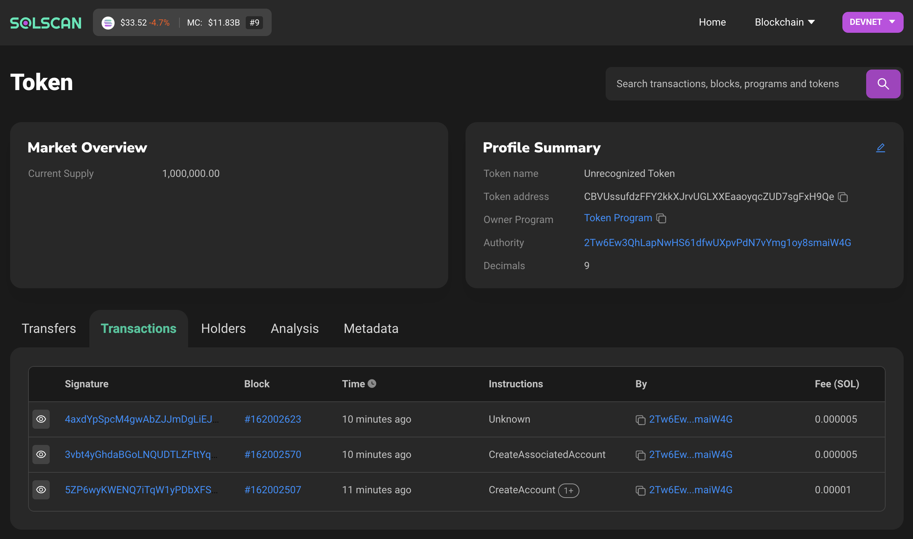

# My journey learning solana

**Solana** is a blockchain project setout to improve transaction speed and minimize transaction fees. The main difference it has with **Ethereum** is it can validate much more transactions per second and the transaction fees are much smaller.

Solana Uses Proof of Stake and Proof of History to reach consensus on transactions. Which simply means **transactions on Solana are verifiably ordered without all nodes needing to agree simultaneously.**

Transactions are validated using the timestamp data but Validators still need to stake some amount of **SOL** (the native coin on the chain) to be able to validate and submit transactions.

Solana is **Single-Chain**. Other new blockchains, have similar speed by using sharding, creating sidechains that tie back into the main Ethereum blockchain. Solana does everything on one single chain, in a single state. 

## Learning Projects
---
Interacting with the Solana Chain
using the javascript SDK (@Solana/Web3.js)

### Connecting to Devnet

```typescript
import {Connection, clusterApiUrl} from '@solana/web3.js';

async function connect() {
    const connection = new Connection(clusterApiUrl('devnet'), 'confirmed);
}

connect()
```
### Creating a solana token named `EtherFiber`
In order to be able create a new token on solana, first we have to install Solana SPL Tool found here [Installation Guide](https://docs.solana.com/cli/install-solana-cli-tools#use-solanas-install-tool)

After installing SPL Tool we are now ready to create a new token.

### **1. Create a new Token**
To create a new token run the following command in your console 
```console
$ spl-token create-token
```
**Result**

``` console            
Creating token CBVUssufdzFFY2kkXJrvUGLXXEaaoyqcZUD7sgFxH9Qe

Address:  CBVUssufdzFFY2kkXJrvUGLXXEaaoyqcZUD7sgFxH9Qe
Decimals: 9

Signature: 5ZP6wyKWENQ7iTqW1yPDbXFShqL19AGXjNwXEYbqdsigoM7v9M7iUDQUV3DDhuCJRWhGq24Tppy3ZKNoXocCJZWw
```
The command will return a token identifier `CBVUssufdzFFY2kkXJrvUGLXXEaaoyqcZUD7sgFxH9Qe` which we'll use in the future to identify the token in other transactions.

### **2. Create an Account**

What we did above is create a token, now we need to have an account to store it. Here we need to mention which type of coin the account will hold, sort of like account currency in a bank.

```console
$ spl-token create-account CBVUssufdzFFY2kkXJrvUGLXXEaaoyqcZUD7sgFxH9Qe
```

**Result**

```console
Creating account 63xLS3Ya6zAWH9p4mFbJHJfhMEoZfQ1hbVHPa92L8T2U

Signature: 3vbt4yGhdaBGoLNQUDTLZFttYqNZfbf5xCoiqHf4vd8vnxGn4EL1sTYUuKj2RoTWZ7FTbV1RGtCdh1eXeJaVx2AX
```

We have now successfully created an account with the address `63xLS3Ya6zAWH9p4mFbJHJfhMEoZfQ1hbVHPa92L8T2U`

### **3.Minting Coins**

Minting coins is the process of generating new coins. Only Authorized accounts can mint coins

We can mint `1,000,000` coins using the command bellow.

```console
$ spl-token mint CBVUssufdzFFY2kkXJrvUGLXXEaaoyqcZUD7sgFxH9Qe 1000000
```

**Result**

```console
Minting 1000000 tokens
  Token: CBVUssufdzFFY2kkXJrvUGLXXEaaoyqcZUD7sgFxH9Qe
  Recipient: 63xLS3Ya6zAWH9p4mFbJHJfhMEoZfQ1hbVHPa92L8T2U

Signature: 4axdYpSpcM4gwAbZJJmDgLiEJctHetcBiEPCcGPkgeuKxFQ99d843BXL2s7jzSTQAVcbeM9sd8FDZGB3krNmpKGb
```

We have now Successfully minted `1,000,000` coins

### **4. Checking Balance**
We can check the balance (total supply) by running the following command

``` command
$ spl-token balance CBVUssufdzFFY2kkXJrvUGLXXEaaoyqcZUD7sgFxH9Qe
```

**Result**
```console
1000000
```

We can also view our new token on solscan.io
   

### **5. Adding Metadata to your coin**
You might want to make your token show up in user's wallets with a name, ticker, and image. Solana uses the [Token Metadata Program from Metaplex](https://docs.metaplex.com/token-metadata/specification#token-standards) to achieve this. 

#### **5.1. Metadata Format**
Since our token is a Fungible token we'll use the Fungible Token Standard, You can find below a sample of a metadata format.

```json
{
  "name": "Coin name",
  "symbol": "Symbol",
  "image": "Image link"
}
```
This file should be hosted somewhere and accessible via a URL.
you can use github to host your json file. 

You can find example [here](https://raw.githubusercontent.com/AdoniasMulugeta/learning-solana/main/metadata.json).

#### **5.2. Attaching Metadata**
To attach the metadata to the mint account, you need to install the following libraries 
```console
$ npm i -d @metaplex-foundation/mpl-token-metadata
```
Here's the code to add the metadata to a coin.

```javascript
    import { createCreateMetadataAccountV2Instruction, PROGRAM_ID} from '@metaplex-foundation/mpl-token-metadata';
    import {Connection, Keypair, PublicKey, sendAndConfirmTransaction, Transaction} from "@solana/web3.js"
    import fs from "fs"
    async function main(){
        const myKeyPair = Keypair.fromSecretKey(
            new Uint8Array(
                JSON.parse(fs.readFileSync("keypair.json"))
            )
        )
        const seed1 = Buffer.from("metadata");
        const seed2 = Buffer.from(PROGRAM_ID.toBytes());
        const seed3 = Buffer.from(mintPublicKey.toBytes());

        const [metadataPDA, _bump] = await PublicKey.findProgramAddress([
            Buffer.from("metadata"),
            Buffer.from(PROGRAM_ID.toBytes()),
            Buffer.from(mintPublicKey.toBytes())
        ], PROGRAM_ID)

        const accounts = {
            metadata: metadataPDA,
            mint: mintPubKey,
            mintAuthority: myKeyPair.publicKey,
            payer: myKeyPair.publicKey,
            updateAuthority: myKeyPair.publicKey
        }

        const txn = new Transaction().add(
            createCreateMetadataAccountV2Instruction(accounts,
                {
                    createMetadataAccountArgsV2: {
                        data: {
                            name: "Ether Fiber", 
                            symbol: "ETF",
                            uri: "https://raw.githubusercontent.com/AdoniasMulugeta/learning-solana/main/metadata.json",
                            sellerFeeBasisPoints: 0,
                            creators: null,
                            collection: null,
                            uses: null
                        },
                        isMutable: true,
                    }
                }
            )
        )

        const connection = new Connection("https://api.devnet.solana.com");
        
        return await sendAndConfirmTransaction(connection, txn, [myKeyPair]);
    }

    main()
```


