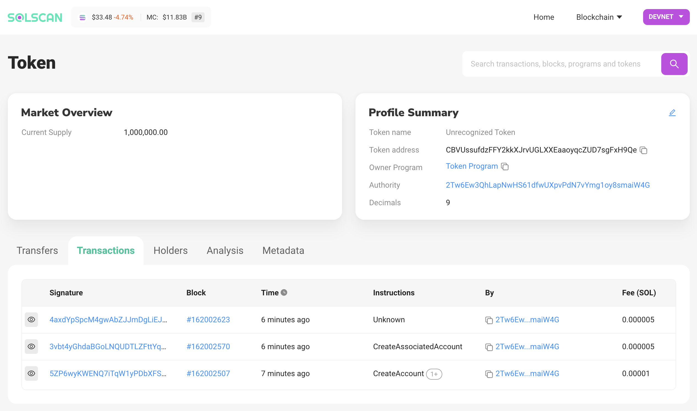

# My journey learning solana

`Solana` is a blockchain project setout to improve transaction speed and minimize transaction fees. The main difference it has with `Ethereum` is it can validate much more transactions per second and the transaction fees are much smaller.

Solana Uses `Proof of History` (A Modified form of Proof of Stake) to reach consensus on transactions. 

Transactions are validated using the timestamp data but Validators still need to stake some amount of `SOL` (the native coin on the chain) to be able to validate and submit transactions.

## Learning Projects
---
Interacting with the Solana Chain
using the javascript SDK (@Solana/Web3.js)

### Connecting to Devnet

```typescript
import {Connection, clusterApiUrl} from '@solana/web3.js';

async function connect() {
    const connection = new Connection(clusterApiUrl('devnet'));
}

connect()
```
### Creating a solana token named `EtherFiber`
In order to be able create a new token on solana, first we have to install Solana SPL Tool found here [Installation Guide](https://docs.solana.com/cli/install-solana-cli-tools#use-solanas-install-tool)

After installing SPL Tool we are now ready to create a new token.

### **1. Create a new Token**
To create a new token run the following command in your console 
```console
$ spl-token create-token
```
**Result**

``` console            
Creating token CBVUssufdzFFY2kkXJrvUGLXXEaaoyqcZUD7sgFxH9Qe

Address:  CBVUssufdzFFY2kkXJrvUGLXXEaaoyqcZUD7sgFxH9Qe
Decimals: 9

Signature: 5ZP6wyKWENQ7iTqW1yPDbXFShqL19AGXjNwXEYbqdsigoM7v9M7iUDQUV3DDhuCJRWhGq24Tppy3ZKNoXocCJZWw
```
The command will return a token identifier `CBVUssufdzFFY2kkXJrvUGLXXEaaoyqcZUD7sgFxH9Qe` which we'll use in the future to identify the token in other transactions.

### **2. Create an Account**

What we did above is create a token, now we need to have an account to store it. Here we need to mention which type of coin the account will hold, sort of like account currency in a bank.

```console
$ spl-token create-account CBVUssufdzFFY2kkXJrvUGLXXEaaoyqcZUD7sgFxH9Qe
```

**Result**

```console
Creating account 63xLS3Ya6zAWH9p4mFbJHJfhMEoZfQ1hbVHPa92L8T2U

Signature: 3vbt4yGhdaBGoLNQUDTLZFttYqNZfbf5xCoiqHf4vd8vnxGn4EL1sTYUuKj2RoTWZ7FTbV1RGtCdh1eXeJaVx2AX
```

We have now successfully created an account with the address `63xLS3Ya6zAWH9p4mFbJHJfhMEoZfQ1hbVHPa92L8T2U`

### **3.Minting Coins**

Minting coins is the process of generating new coins. Only Authorized accounts can mint coins

We can mint `1,000,000` coins using the command bellow.

```console
$ spl-token mint CBVUssufdzFFY2kkXJrvUGLXXEaaoyqcZUD7sgFxH9Qe 1000000
```

**Result**

```console
Minting 1000000 tokens
  Token: CBVUssufdzFFY2kkXJrvUGLXXEaaoyqcZUD7sgFxH9Qe
  Recipient: 63xLS3Ya6zAWH9p4mFbJHJfhMEoZfQ1hbVHPa92L8T2U

Signature: 4axdYpSpcM4gwAbZJJmDgLiEJctHetcBiEPCcGPkgeuKxFQ99d843BXL2s7jzSTQAVcbeM9sd8FDZGB3krNmpKGb
```

We have now Successfully minted `1,000,000` coins

### **4. Checking Balance***
We can check the balance (total supply) by running the following command

``` command
$ spl-token balance CBVUssufdzFFY2kkXJrvUGLXXEaaoyqcZUD7sgFxH9Qe
```

**Result**
```console
1000000
```

We can also view our new token on solscan.io
  


